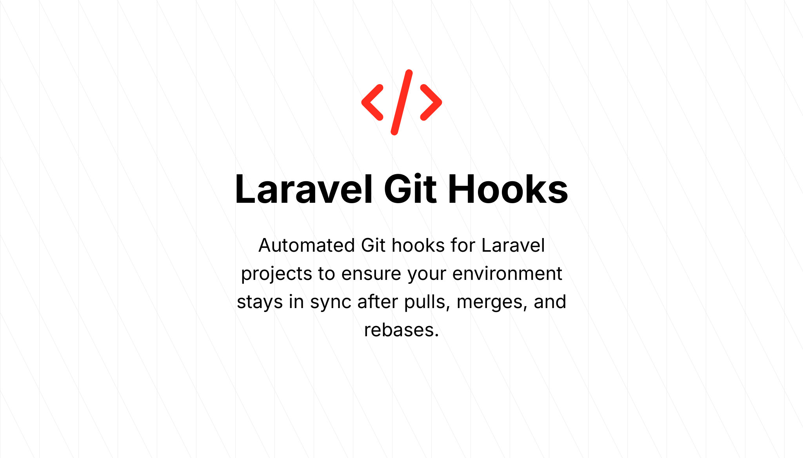

# Laravel Git Hooks

Automated Git hooks for Laravel projects to ensure your environment stays in sync after pulls, merges, and rebases.

## What it does

This tool automatically sets up Git hooks that run common Laravel maintenance tasks when your codebase changes due to:

- Git merges (`git merge`)
- Squash merges (`git merge --squash`)
- Rebases (`git rebase`)

When these Git operations happen, the script automatically:

- Runs `npm install` when `package.json` changes
- Runs `composer install` when `composer.json` changes
- Runs database migrations when new migrations are detected
- Alerts you when `.env.example` changes

## Installation

### Automated Installation

You can install the script using a one-liner command. Run the following command in your terminal:
```sh
/bin/bash -c "$(curl -fsSL https://raw.githubusercontent.com/G4b0rDev/Laravel-Git-Hooks/main/install.sh)"
```

### Manual Installation

1. Copy the `script.sh` file to your Laravel project root
2. Make it executable:
   ```bash
   chmod +x script.sh
   ```
3. Run it once to install the hooks:
   ```bash
   ./script.sh
   ```

## How it works

The script installs itself as three Git hooks:

- `post-merge`: Triggered after merges
- `post-commit`: Triggered after commits (captures squash merges)
- `post-rewrite`: Triggered after rebases

Each hook examines which files changed and runs the appropriate commands automatically.

## Manual Triggering

You can manually trigger the hooks process by running:

```bash
./script.sh
```

This is useful after manually modifying files or when setting up a new development environment.
